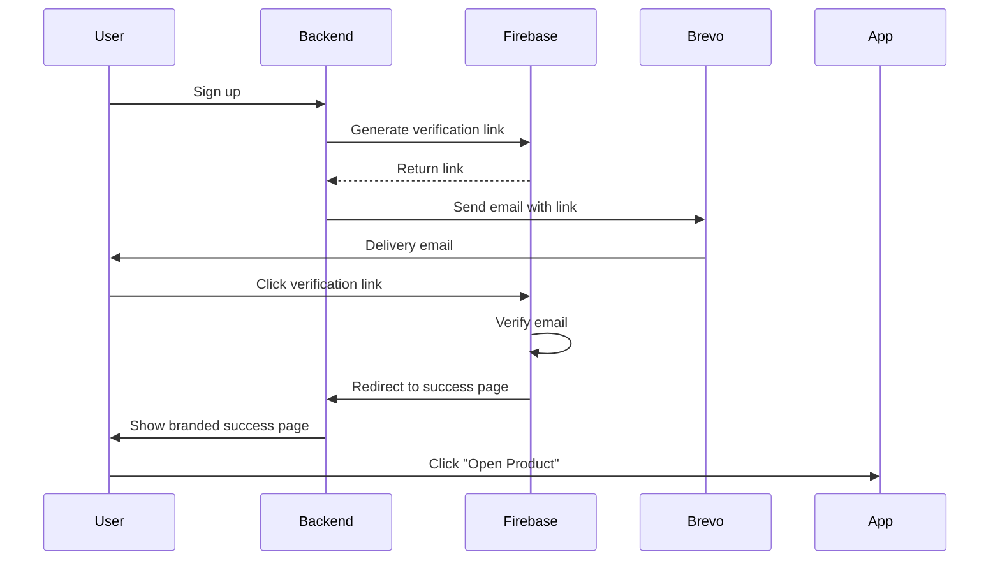

# Success Pages & Verification Flow

This document explains how the branded success pages work when users click verification or password reset links.

## Overview

When users receive emails (verification, password reset), they click links that redirect to Firebase for authentication, then back to our branded success pages.

## Available Success Pages

### 1. Email Verification Success
**URL**: `GET /api/email/verify-confirmation/`
**Template**: `auth_service/templates/emails/verification_success.html`

**Features**:
- ✅ Product-specific branding with logo
- ✅ OneClickMed gradient background (#0fcbff to #014f6c)
- ✅ Animated success icon
- ✅ Environment badge (test/prod)
- ✅ "Open {Product}" button to return to app
- ✅ Support contact link

**Query Parameters**:
- `token` - Firebase verification token (required)
- `environment` - test or prod (default: prod)
- `product` - Product name (default: "Our Service")

**Example**:
```
https://auth.oneclickmed.ng/api/email/verify-confirmation/?token=abc123&environment=test&product=Beta+Health
```

### 2. Password Reset Success
**Template**: `auth_service/templates/emails/password_reset_success.html`

**Features**:
- ✅ Product-specific branding with logo
- ✅ OneClickMed gradient background
- ✅ Lock icon (🔑)
- ✅ Clear instructions about email sent
- ✅ Environment badge
- ✅ "Return to {Product}" button
- ✅ Support contact link

**Usage**: Can be shown after password reset email is sent successfully.

## Design Specifications

### Colors
- **Primary**: `#0fcbff` (OneClickMed Turquoise)
- **Secondary**: `#014f6c` (Dark Blue)
- **Success**: `#27ae60` (Green)
- **Test Badge**: `#f39c12` (Orange)
- **Text**: `#333333` (Dark Gray)

### Layout
- **Max Width**: 600px
- **Padding**: 50px 40px (mobile: 30px 20px)
- **Border Radius**: 12px
- **Shadow**: `0 10px 40px rgba(0, 0, 0, 0.2)`
- **Background**: Linear gradient (135deg, #0fcbff 0%, #014f6c 100%)

### Animations
- **Slide Up**: Container slides up on page load (0.5s)
- **Scale In**: Success icon scales in (0.6s with 0.2s delay)
- **Button Hover**: Lifts up 2px with shadow enhancement

### Product Logos
- **Beta Health**: `https://oneclickmed.ng/betahealth_logo.JPG`
- **Default**: `https://oneclickmed.ng/_next/image?url=%2Fassets%2Fimg%2Fonclickmedlogo.png&w=384&q=75`

## How It Works

### Email Verification Flow

1. **User signs up** → Backend sends verification email via Brevo
2. **Email contains Firebase link** → Clicking verifies email with Firebase
3. **Firebase redirects to success page** → Shows branded confirmation
4. **User clicks "Open {Product}"** → Returns to app



### Password Reset Flow

1. **User requests password reset** → Backend sends reset email via Brevo
2. **Email contains Firebase link** → Clicking opens Firebase password reset UI
3. **User sets new password** → Firebase handles password change
4. **Success page shown** → Confirms reset email sent

## Implementation in Views

### VerifyEmailConfirmationView

Located in `auth_service/views.py`:

```python
class VerifyEmailConfirmationView(APIView):
    """Shows branded success page after email verification"""
    permission_classes = []  # Public endpoint

    def get(self, request):
        token = request.GET.get('token', '')
        environment = request.GET.get('environment', 'prod')
        product_name = request.GET.get('product', 'Our Service')

        # Render branded success page
        success_html = EmailTemplateRenderer.render_verification_success(
            product_name=product_name,
            dashboard_link=f"https://app.example.com/dashboard?environment={environment}",
            environment=environment
        )

        return HttpResponse(success_html)
```

### Email Templates Integration

In `auth_service/utils/email_templates.py`:

```python
class EmailTemplateRenderer:
    PRODUCT_LOGOS = {
        'Beta Health': 'https://oneclickmed.ng/betahealth_logo.JPG',
        'beta_health': 'https://oneclickmed.ng/betahealth_logo.JPG',
    }
    DEFAULT_LOGO = 'https://oneclickmed.ng/...'

    @staticmethod
    def render_verification_success(product_name, dashboard_link, environment='prod'):
        """Renders branded verification success page"""
        context = {
            'product_name': product_name,
            'dashboard_link': dashboard_link,
            'environment': environment,
            'environment_label': EmailTemplateRenderer.get_environment_label(environment),
            'product_logo_url': EmailTemplateRenderer.get_product_logo_url(product_name)
        }
        return render_to_string('emails/verification_success.html', context)
```

## Testing

### Test Verification Success Page

```bash
# Local testing
curl "http://localhost:8000/api/email/verify-confirmation/?token=test123&environment=test&product=Beta%20Health"

# Production testing
curl "https://auth.oneclickmed.ng/api/email/verify-confirmation/?token=test123&environment=prod&product=Beta%20Health"
```

### Expected Result
- Fully rendered HTML page with:
  - Beta Health logo
  - Gradient background
  - Animated checkmark
  - Environment badge (TEST or PRODUCTION)
  - "Open Beta Health" button
  - Support email link

## Mobile Responsiveness

All success pages are fully responsive:

- **Desktop**: Full padding, large fonts
- **Mobile**: Reduced padding, optimized font sizes
- **Breakpoint**: 480px

```css
@media only screen and (max-width: 480px) {
    body { padding: 10px; }
    .container { padding: 30px 20px; }
    h1 { font-size: 24px; }
    .button { padding: 14px 30px; font-size: 14px; }
}
```

## Dashboard Links

Currently placeholder. Update these in views.py when you have actual app URLs:

```python
# Example product-specific dashboard links
DASHBOARD_LINKS = {
    'Beta Health': {
        'test': 'https://test.betahealth.app',
        'prod': 'https://betahealth.app'
    },
    'EHR': {
        'test': 'https://test.ehr.oneclickmed.ng',
        'prod': 'https://ehr.oneclickmed.ng'
    },
    'Emergency Service': {
        'test': 'https://test.emergency.oneclickmed.ng',
        'prod': 'https://emergency.oneclickmed.ng'
    }
}
```

## Future Enhancements

1. **Deep Links**: Return users to specific app pages (e.g., `betahealth://verified`)
2. **User Info**: Display user's name if available
3. **Analytics**: Track page views and button clicks
4. **Multi-language**: Support for different languages
5. **Custom CTAs**: Product-specific call-to-action messages

## Troubleshooting

### Page not loading
- Check URL parameters are correctly encoded
- Verify template file exists
- Check logs: `tail -f logs/django.log`

### Styling issues
- Clear browser cache
- Check CSS is inline (no external stylesheets)
- Test in different browsers

### Logo not showing
- Verify logo URL is accessible
- Check CORS settings for image domain
- Use browser dev tools to inspect network requests

## Support

For questions or issues:
- Email: support@oneclickmed.ng
- Check logs: `/logs/django.log`
- Review views: `auth_service/views.py`
- Review templates: `auth_service/templates/emails/`
